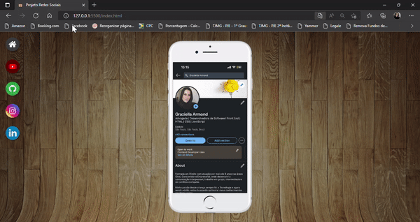

## Projeto do Curso em Video - Módulo 04 do HTML e CSS

 Aproveitei e realizei todas as adptações para inserção das minhas redes sociais. 

<figure>
    
</figure>

Utilizei HTML e CSS
- Flexbox
- iframe
- position

